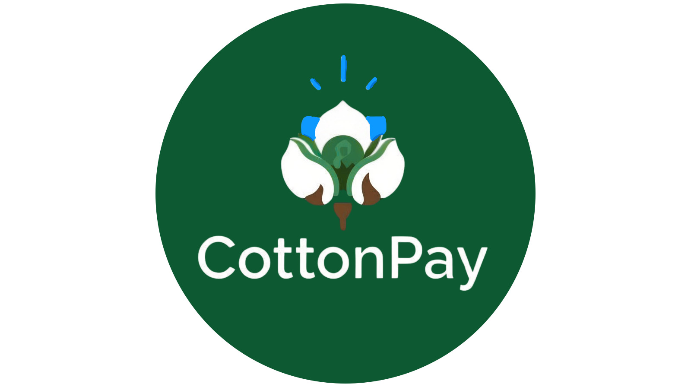

# CottonPay — Traçabilité Numérique et Identité Économique pour Producteurs de Coton

<p align="center">
  
</p>

CottonPay est une plateforme de traçabilité numérique destinée aux producteurs de coton au Bénin. Elle permet aux coopératives (CVPC) d'enregistrer chaque livraison de coton et d'émettre un **credential vérifiable** que le producteur stocke dans son wallet mobile **e-IDapp**. Le système combine l'authentification nationale via **eSignet (MOSIP)** avec le NPI et l'émission de credentials via **eidStack-CMU**, ancrés sur le registre **BCovrin**.

## 📊 Présentation du Projet

**<a href="/EVOLUTICS-presentation.pptx">Télécharger la présentation PowerPoint</a>**

## 🎥 Vidéo de Démonstration

**<a href="https://youtu.be/4Qb5R3kSnQI?feature=shared" target="_blank">Voir la démo sur YouTube</a>**

## 🎬 Vidéo de Présentation

**<a href="https://youtu.be/TbJYOXCMzmM" target="_blank">Voir la présentation sur YouTube</a>**

## 📁 Ressources Vidéo

**<a href="https://drive.google.com/drive/folders/1BX5NdTjXHq6yUXGQthe9Kd3KibYA479C" target="_blank">Accéder au dossier Google Drive avec les vidéos</a>**

## Prérequis

### Pour Windows

- **Windows 10/11** avec WSL 2 activé
- **Docker Desktop** (version 20.10+)
- **Git Bash** ou terminal compatible bash

### Installation de WSL 2

Si WSL n'est pas encore installé, ouvrez PowerShell en tant qu'administrateur et tapez :

```powershell
wsl --install
```

Redémarrez votre PC, puis installez Ubuntu :

```powershell
wsl --install -d Ubuntu-24.04
```

Créez un nom d'utilisateur et mot de passe pour Ubuntu.

## Installation et Démarrage

**NB :** Tous les chemins relatifs supposent que vous êtes à la racine du projet EVOLUTICS-did-hackathon.

### PARTIE 1

#### Étape 1 : Cloner le projet

```bash
git clone https://github.com/Bsh54/EVOLUTICS-did-hackathon.git
cd EVOLUTICS-did-hackathon
```

#### Étape 2 : Installation

Dans Git Bash ou terminal Windows :

```bash
./install.sh
```

**Ce script effectue :**

- Vérification des prérequis (Docker, Node.js, npm, curl)
- Création du réseau Docker `mosip_network`
- Installation des dépendances npm de CottonPay
- Création du fichier `.env` depuis `.env.example`
- Création des dossiers `keys/` et `logs/`

#### Étape 3 : Démarrage

Dans Git Bash ou terminal Windows :

```bash
./start.sh
```

**Ce script effectue :**

- Démarrage des conteneurs Docker eSignet
- Attente du démarrage complet d'eSignet (2-4 minutes)
- Enregistrement du client OIDC avec génération des clés RSA
- Création de l'utilisateur de test
- Démarrage du backend CottonPay

#### Étape 4 : Accéder à l'application

Ouvrez votre navigateur : **http://localhost:3002**

**Identifiants de test (représentant coopérative) :**

- **NPI** : `9876543210987654` (Kokou Agossou, président CVPC)
- **OTP** : `111111`

**Flux d'authentification :**

1. Cliquez sur **"Espace Coopérative"** dans la barre de navigation
2. Vous êtes redirigé vers eSignet
3. Entrez le NPI et le code OTP
4. Vous accédez au dashboard coopérative

---

### PARTIE 2 : eidStack-CMU (WSL Ubuntu)

**NB :** Si vous avez cloné le projet dans Windows (par exemple `C:\Users\EVOLUTICS-did-hackathon`), le chemin depuis WSL sera `/mnt/c/Users/EVOLUTICS-did-hackathon`

#### Étape 0 : Correction des fins de ligne (obligatoire)

Avant l'installation, convertissez les fins de ligne des scripts bash :

Ouvrez un terminal WSL

```bash
wsl
cd /mnt/c/Users/EVOLUTICS-did-hackathon
sed -i 's/\r$//' install-eidstack.sh
sed -i 's/\r$//' setup-agent.sh
```

**Note :** Cette étape est nécessaire car les scripts peuvent avoir des fins de ligne Windows (CRLF) qui causent des erreurs sur Linux/WSL.

#### Étape 1 : Installation

Ouvrez un terminal WSL :

```bash
wsl
cd /mnt/c/Users/EVOLUTICS-did-hackathon
./install-eidstack.sh
```

**Ce script effectue :**

- Installation automatique de Node.js v18.17.1 via nvm
- Installation de PostgreSQL et création de la base de données
- Installation des outils de compilation
- Installation des dépendances npm avec --legacy-peer-deps
- Configuration de Prisma et migrations

#### Étape 2 : Démarrage

Dans un terminal WSL :

```bash
wsl
cd /mnt/c/Users/EVOLUTICS-did-hackathon/eidStack-CMU

# Démarrer PostgreSQL si nécessaire
sudo service postgresql start

# Démarrer le serveur
npm run start:dev
```

Le serveur démarre sur **http://localhost:4000**

#### Étape 3 : Initialisation de l'agent SSI

**IMPORTANT : Avant d'exécuter ce script, vous devez enregistrer manuellement le DID sur BCovrin.**

**Étape 3a : Enregistrement du DID sur BCovrin**

1. Accédez à : **http://test.bcovrin.vonx.io/**
2. Remplissez le formulaire d'enregistrement :
   - **Seed** : Entrez un seed unique (exemple : `CottonPayBenin2024Issuer00000000`)
   - **Alias** : `CottonPay-Issuer`
   - **Role** : Sélectionnez **ENDORSER** (obligatoire)
3. Cliquez sur **"Register DID"**
4. Notez le **Seed** et le **DID** retournés

**Étape 3b : Mise à jour du script setup-agent.sh**

Modifiez la ligne 13 du fichier `setup-agent.sh` avec le seed obtenu :

```bash
SEED="<votre-seed-bcovrin>"
```

**Étape 3c : Redémarrage du serveur eidStack**

Le serveur eidStack doit être redémarré après chaque modification du seed :

```bash
# Dans le terminal WSL où tourne npm run start:dev
# Appuyez sur Ctrl+C pour arrêter le serveur

# Relancez le serveur
npm run start:dev
```

**Étape 3d : Initialisation de l'agent**

Dans un **autre terminal WSL** :

```bash
wsl
cd /mnt/c/Users/EVOLUTICS-did-hackathon
./setup-agent.sh
```

Le script vous demandera confirmation que vous avez bien enregistré le DID sur BCovrin avec le rôle ENDORSER.

**Ce script effectue :**

- Initialisation de l'agent SSI avec le DID enregistré
- Création des schémas (FarmerIdentityCredential, CottonSaleReceiptCredential)
- Création des Credential Definitions

---

## PARTIE 3 : e-IDapp_CMU (Portefeuille Mobile)

**e-IDapp_CMU** est l'application mobile qui permet aux producteurs de recevoir et stocker leurs credentials vérifiables sur leur smartphone.

### Étape 6 : Configurer la connexion USB (à chaque reconnexion)

```powershell
# Dans PowerShell (Windows)
adb reverse tcp:4000 tcp:4000
adb reverse tcp:3021 tcp:3021
```

**Pourquoi ?** `adb reverse` redirige le `localhost` du téléphone vers le `localhost` du PC. Sans ça, l'application mobile ne
peut pas atteindre le serveur.

> **Important :** Cette commande doit être relancée à chaque fois que le téléphone est débranché/rebranché.

### Étape 7 : Accéder à l'application

Ouvrez votre navigateur : **http://localhost:3002**

**Identifiants de test (représentant coopérative) :**

- **NPI** : `9876543210987654` (Kokou Agossou, président CVPC)
- **OTP** : `111111`

**Flux d'authentification :**

1. Cliquez sur **"Espace Coopérative"** dans la barre de navigation
2. Vous êtes redirigé vers eSignet
3. Entrez le NPI puis le code OTP
4. Vous accédez au dashboard coopérative

> **Note :** La page d'accueil propose aussi un portail de vérification publique et l'application e-IDapp pour les producteurs.

---

## Utilisation

### Enregistrer une livraison

1. Sur le dashboard, cliquez sur **"Enregistrer une livraison"**
2. Saisissez le NPI du producteur — le système vérifie son identité
3. Entrez le poids (kg) et la qualité :
   - **1er choix** : 300 FCFA/kg
   - **2ème choix** : 250 FCFA/kg
4. Cliquez sur **"Enregistrer la livraison"**
5. Le système :
   - Calcule le montant total et les déductions (crédit intrants, redevance AIC)
   - Émet un credential vérifiable via eidStack-CMU
   - Génère un QR code contenant l'invitation DIDComm
6. Un QR code + bordereau PDF s'affichent sur l'écran

### Recevoir le credential sur le téléphone

1. Ouvrez l'application **e-IDapp (IDS Wallet)** sur votre téléphone Android
2. Appuyez sur **"Scan QR"**
3. Scannez le QR code affiché sur le bordereau
4. L'application affiche les détails du credential (type, émetteur, attributs)
5. Appuyez sur **"Accept"** pour stocker le credential dans votre wallet
6. Le credential est stocké de manière souveraine dans le wallet du producteur

### Vérification publique

1. Accédez à **http://localhost:3002/verify.html**
2. Saisissez le NPI du producteur
3. Le producteur s'authentifie via eSignet (OTP)
4. L'historique certifié de ses livraisons s'affiche — vérifiable par une banque ou institution

---

## Flux Technique

### Flux d'authentification OIDC

```
Utilisateur → CottonPay (localhost:3002)
    ↓ GET /auth/login
Génération PKCE (code_verifier, code_challenge)
    ↓ Redirection
eSignet UI (localhost:3000)
    ↓ NPI + OTP
Mock Identity System (localhost:8082) valide l'identité
    ↓ Code d'autorisation
CottonPay ← callback avec code
    ↓ POST /oauth/v2/token (avec client_assertion JWT signé)
eSignet retourne access_token + id_token
    ↓ GET /oidc/userinfo
Récupération des claims utilisateur → Session → Dashboard
```

### Flux d'émission de credential

```
CottonPay → POST http://localhost:4000/issuance/offer
    ↓ Création invitation Out-of-Band (OOB)
eidStack-CMU → Génère invitation + Short URL + QR code
    ↓ Réponse avec shortUrl et invitationQr

Téléphone scanne le QR code
    ↓ Contient : http://localhost:4000/short-url/s/<code>
idsWallet → fetch(shortUrl) avec redirect:follow
    ↓ Résolution du Short URL → URL complète avec ?oob=<base64>
idsWallet → agent.oob.receiveInvitationFromUrl(fullUrl)
    ↓ Connexion DIDComm établie
Agent (port 3021) ↔ idsWallet
    ↓ OfferReceived → acceptOffer → CredentialReceived → acceptCredential → Done
Credential stocké dans le wallet avec tous ses attributs
```

### Flux de vérification publique (verify.html)

```
Banque/Institution → CottonPay (localhost:3002/verify.html)
    ↓ Saisie du NPI du producteur
Redirection vers eSignet → Producteur s'authentifie (NPI + OTP)
    ↓ Identité vérifiée, consentement obtenu
CottonPay Backend → Récupération des livraisons certifiées
    ↓ Affichage de l'historique complet
Résultat : Historique vérifié avec statut des credentials ✅
```

## Structure du projet

```
EVOLUTICS-did-hackathon/
├── install.sh              # Installation CottonPay + eSignet (Windows)
├── start.sh                # Démarrage CottonPay + eSignet (Windows)
├── install-eidstack.sh     # Installation eidStack-CMU (WSL)
├── setup-agent.sh          # Initialisation agent SSI (WSL, une fois)
├── logo.jpeg                # Logo CottonPay
├── CottonPay/              # Application principale
│   ├── frontend/           # Interface utilisateur (HTML/CSS/JS)
│   ├── backend/            # API REST Node.js + Express
│   └── scripts/            # Scripts d'enregistrement OIDC
├── esignet-master/         # Infrastructure d'authentification (Docker)
│   └── docker-compose/     # PostgreSQL, Redis, eSignet, Mock Identity
├── eidStack-CMU/           # Service d'émission de credentials (WSL)
│   ├── src/                # API REST NestJS
│   └── prisma/             # Base de données PostgreSQL
└── e-IDapp_CMU/            # Application mobile portefeuille (Android/iOS)
    ├── src/                # Code source React Native
    ├── android/            # Projet Android natif
    └── ios/                # Projet iOS natif
```

## Services disponibles

| Port | Service               | Description                  | Environnement     |
| ---- | --------------------- | ---------------------------- | ----------------- |
| 3000 | eSignet UI            | Interface d'authentification | Docker (Windows)  |
| 3002 | CottonPay             | Application principale       | Node.js (Windows) |
| 3021 | Agent DIDComm         | Transport credentials        | WSL Ubuntu        |
| 4000 | eidStack-CMU          | API émission credentials     | WSL Ubuntu        |
| 5432 | PostgreSQL (eidStack) | Base de données eidStack     | WSL Ubuntu        |
| 5455 | PostgreSQL (eSignet)  | Base de données eSignet      | Docker (Windows)  |
| 6379 | Redis                 | Cache eSignet                | Docker (Windows)  |
| 8082 | Mock Identity         | Système d'identité de test   | Docker (Windows)  |
| 8088 | eSignet Backend       | API OIDC                     | Docker (Windows)  |

## Logs

```bash
# Backend CottonPay (Windows)
tail -f CottonPay/logs/backend.log

# eSignet (Windows)
docker compose -f esignet-master/docker-compose/docker-compose.yml logs -f

# eidStack-CMU (WSL)
# Les logs s'affichent directement dans le terminal où tourne npm run start:dev
```

## Arrêt des services

### Arrêter CottonPay + eSignet (Windows)

```bash
# Arrêter le backend CottonPay
kill $(cat .cottonpay.pid)
rm .cottonpay.pid

# Arrêter eSignet
cd esignet-master/docker-compose
docker compose down
```

### Arrêter eidStack-CMU (WSL)

Dans le terminal WSL où tourne le serveur, tapez `Ctrl+C`

---

## Troubleshooting

### Erreur : "Permission denied: DID lacks ENDORSER role"

**Cause :** Le DID n'a pas le rôle ENDORSER sur BCovrin, ou le serveur eidStack utilise un ancien DID en mémoire.

**Solution :**

1. Vérifiez que le DID est bien enregistré avec le rôle **ENDORSER** sur http://test.bcovrin.vonx.io/
2. Redémarrez le serveur eidStack :
   ```bash
   # Dans le terminal WSL où tourne npm run start:dev
   # Appuyez sur Ctrl+C
   npm run start:dev
   ```
3. Relancez le script d'initialisation :
   ```bash
   ./setup-agent.sh
   ```

### Erreur : "Unexpected token \r in JSON"

**Cause :** Les scripts bash ont des fins de ligne Windows (CRLF) au lieu de Unix (LF).

**Solution :**

```bash
sed -i 's/\r$//' setup-agent.sh install-eidstack.sh
```

Puis relancez le script.

---

## Équipe

**Team EVOLUTICS - Université d'Abomey-Calavi (UAC)**
